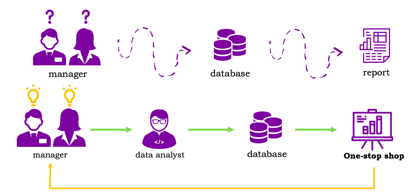
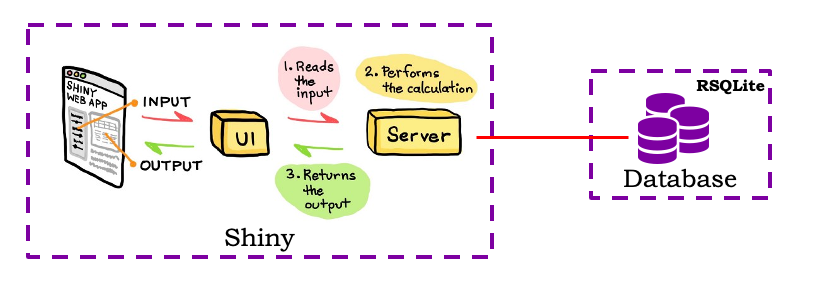
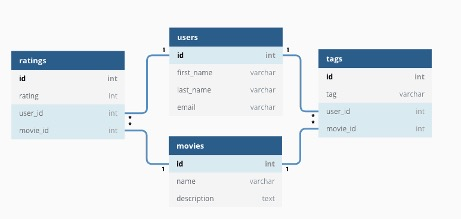
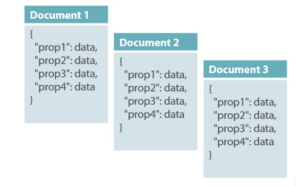
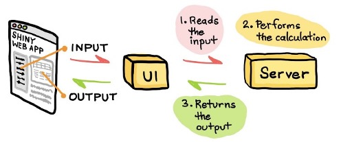
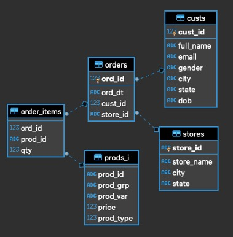
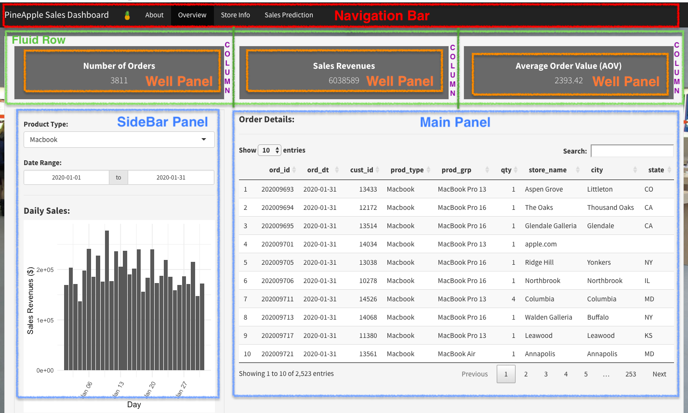

******
## The one-stop shop
In the business world, with each transaction, tons of operational data are generated. On a daily basis, decision makers sit on these data with untold stories and insights to be discovered. For instance, what is working well? And what calls for attention? Decision makers need the answers delivered to them timely across the departments, and presented to them effectively, better in real time with visual representations of the results. 

In the course of a business process, a company produces data, collects its own data, and makes use of them. When used effectively, data offer insights into a company's business and strategies, and ultimately improve the company's operations. That's what we call "business intelligence". To generate business intelligence, decision makers make ad hoc requests from time to time when the need emerges. These requests are usually allocated to data analysts; some of them are repetitive, time-consuming work that really can be automated. 

Therefore, ideally, there is a system that automates the repetitive queries. It grabs data from the databases, then processes the extracted data to generate business analytics, and incorporates the outputs in a decorated dashboard and report in the end. The system takes care of itself, and it never sleeps while the back-end databases keep updating themselves. 

<center>



*Figure 1. How a data analyst comes to help with the one-stop shop*

</center>

That's what a one-stop shop is, and what this post is about. 

As shown in the bottom part of *Figure 1*, as opposed to the top part where the managers may easily lose their minds, a "data analyst" comes to help with the one-stop shop and a framework that integrates various kinds of requests made by the managers. The managers then will be able to see what they need immediately with a few points and clicks in an interactive environment. 

******
### Our story
In our story, we have a technology company, PineApple Inc. At one of their board meetings, the business managers are making budgets for the 2H FY (the second half of the fiscal year). In order to review the budget, costs and revenue of the past few months, the following questions start to pop up in the heads of the managers: How many orders have been placed in the last quarter? What are the order details? What is the revenue of the last month? What do our sales look like across the country? What will the estimated sales revenue be for the next 6 months? And many more questions like these. 

To answer these questions, we need an environment where we can interact with the database and build data products. The two big parts that enable this one-stop shop are database connection, query and update (with RSQLite), and analytics and visualization (with Shiny). 

In this post, we will build a prototype of this one-stop shop, which is a [business intelligence dashboard](https://yundai.shinyapps.io/2020-business-intelligence/). 

In the sections below, we discuss how to: 

- build this one-stop shop to handle requests arising from real-life business scenarios, including database query, database update, analytics, visualization, interactive dashboard, and other ad hoc requests;
- connect to a database, make database queries and update tables in the database with relevant R packages;
- create and deploy Shiny applications to solve business problems discussed above.

******
## Database query as the first step
In this one-stop shop model, there are two ends that need to be connected, back-end database and front-end dashboard. As the first step, we make database queries. We then use what we have extracted from the database to produce business analytics in an interactive Shiny app. The database (local or cloud) and the Shiny app are connected.

<center>



*Figure 2. Workflow of creating the one-stop shop*

</center>

Before diving into the components of our Shiny app, let's take a look at the database side first. 

******
### Relational DB and non-relational DB
There are two common categories of databases: relational databases and non-relational databases. Relational databases store data in rows and columns like in a spreadsheet. To write and retrieve data in relational databases, we use SQL, structured query language. *Figure 3* shows what a relational database may look like.

<center>



*Figure 3. Example of a relational database*

</center>

The demo database we will be using is a relational database.

Non-relational databases handle unstructured data (e.g. text, image, video), and they do not require predefined schemas. They allow for dynamically storing and managing data, and are open to changing requirements in the applications connected to them. *Figure 4* is an example of a non-relational database.

<center>



*Figure 4. Example of a non-relational database*

</center>

With R, we have a number of add-on packages that allow users to work with both relational and non-relational databases without installing external software. For instance, RMariaDB, RMySQL, RPostgreSQL, ROracle, RSQLite, bigrquery, sparklyr are packages for working with relational databases; RcppRedis, mongolite, Rcassandra, R4CouchDB are packages for working with non-relational databases. 

A comprehensive list of packages related to accessibility of different databases can be found [here](https://cran.r-project.org/web/views/Databases.html).

******
### Why RSQLite?
In our case, we have chosen to use SQLite (and hence the R package RSQLite) over many other options. Why?

Because SQLite is a small and self-contained SQL database engine. It is arguably the [most commonly used database engine in the world](https://www.sqlite.org/mostdeployed.html), built into many devices and bundled with countless applications. 

To facilitate interactions between R and SQLite databases, we use the R package RSQLite. It is a powerful tool that embeds the SQLite database engine in R, and that leverages all of the database interaction functionalities also found in other packages like RMySQL and ROracle. Yet, RSQLite, at the same time, is the easiest back-end to start with because it has a complete DBMS (database management system). Other databases, however, use a client-server architecture that can be harder to set up. In such a client-server architecture, there is one database server which has all the data and runs all the queries, together with many database clients; one of those clients can be our R session.

An easy-to-read introduction to RSQLite can be found [here](https://cran.r-project.org/web/packages/RSQLite/vignettes/RSQLite.html).

With RSQLite, we will be using it to connect to and disconnect from a database, send queries, retrieve results, and update tables in the database.

******
## How Shiny can be of help
Now we have the database end ready. What we need next is the other end, an interactive environment with user input, to be set up. Shiny can be of help in that it allows us to easily build interactive web applications with R without knowledge of web development such as CSS, JavaScript and PHP. 

As an oversimplified overview, a Shiny app has 3 components, as shown in *Figure 5*.

- **A user interface ui.R** — the front-end that accepts user input values
- **A server function server.R** — the back-end that processes input values to produce the output results
- **A call to the shinyApp function** — the app itself that combines the UI and the server

<center>



*Figure 5. Schematic illustration of how a Shiny web app works*

</center>

We will show shortly below how different components of a Shiny application function as a whole. 

******
## Database query in Shiny
Now we have both ends explained, it is important to spend a few more minutes on how to make database queries with SQL in a Shiny environment; this lays the foundation of what we will do in the remaining sections. 

******
### PineApple sales database
We will use a sample database that we call *PineApple* sales database to explain what we will be doing and to actually build things up later. It is a SQLite database created in SQLite. It has 5 tables - order items (*order_items*), order details (*orders*), products information (*prods_i*), customer information (*custs*), and store information (*stores*). Order information is generated randomly in SQLite by random sampling, while store and product information is partially based on Apple’s public data. 

According to DBMS theories, each table has its own primary key variable, which is a unique identifier of each record in the table. Each table also has foreign keys to link to other tables. *Figure 5*, the ER diagram for the PineApple sales database, shows the fields in our sample database, the primary key and foreign keys of each table, and the relationships among the tables. The dashed lines indicate that two tables can be linked through a foreign key.

<center>



*Figure 6. ER diagram for PineApple sales database*

</center>

******
### The three steps
In general, at the core of creating our one-stop shop, there are three steps in the process to be found in each component of it: 1) compiling a database query with SQL, 2) issuing that query with RSQLite, and 3) embedding that query in Shiny apps. 

First of all, we need to know how to compile a database query with SQL. Below is the structure of SQL queries we are going to make.

```{r eval=FALSE}
'SELECT a.ord_id, ord_dt, cust_id,
          prod_type, prod_grp, qty,
          store_name, city, state
    FROM orders a
      LEFT JOIN order_items b ON a.ord_id = b.ord_id 
      LEFT JOIN prods_i c ON b.prod_id = c.prod_id
      LEFT JOIN stores d ON a.store_id = d.store_id
    WHERE prod_type = "Macbook"
    ORDER BY ord_dt DESC' 
```

In the above code chunk, we run queries to extract the subset of data (SELECT) from a data table (FROM), then join this table with other tables (JOIN) with common identifiers (ON), where certain conditions are met (WHERE). Finally, we order our subset of data by certain columns (ORDER). 

In this example, we are able to extract the subset of data that contains the information of order id, order date, customer id, product type etc. from the table *orders*, which is then joined with tables order items *order_items*, product information *prods_i*, and stores *stores* with common identifiers (foreign keys) *ord_id*, *prod_id* and *store_id* respectively. We only keep the records for the product type "Macbook" in this subset. The extracted data set is then ordered by *ord_dt* in descending order.

******
Next, in R, to issue the queries above, we call the function `dbConnect()` to connect to a database we named `db`. Note we should always start by loading the package DBI before we load RSQLite, which is DBI-compatible (Wickham, n.d.). We are going to use functions primarily defined in the package DBI.

```{r message=FALSE,warning=FALSE}
library(DBI)
library(RSQLite)
db <- dbConnect(RSQLite::SQLite(), dbname = "pineapple.db")
```

With the function `dbGetQuery()`, using the SQL statement we compiled above, we can execute those queries on the connected database.

```{r eval=TRUE,results='hide'}
dbGetQuery(
      conn = db,
      statement = 
        'SELECT a.ord_id, ord_dt, cust_id,
                  prod_type, prod_grp, qty,
                  store_name, city, state
            FROM orders a
              LEFT JOIN order_items b ON a.ord_id = b.ord_id 
              LEFT JOIN prods_i c ON b.prod_id = c.prod_id
              LEFT JOIN stores d ON a.store_id = d.store_id
            WHERE prod_type = "Macbook"
            ORDER BY ord_dt DESC' )

```

The first several records in this subset are shown below.
```{r eval=TRUE,echo=FALSE}
a<-dbGetQuery(
      conn = db,
      statement = 
        'SELECT a.ord_id, ord_dt, cust_id,
                  prod_type, prod_grp, qty,
                  store_name, city, state
            FROM orders a
              LEFT JOIN order_items b ON a.ord_id = b.ord_id 
              LEFT JOIN prods_i c ON b.prod_id = c.prod_id
              LEFT JOIN stores d ON a.store_id = d.store_id
            WHERE prod_type = "Macbook"
            ORDER BY ord_dt DESC' )

head(a,10)
```


******
Finally, we will make things work in Shiny. On the user interface of Shiny, its front-end, we will need to be able to make database queries with the help of its interactive features (e.g. dropdown list, date range) and view the retrieved data immediately. User input will be translated to a SQL statement, and sent to the back-end database to fetch the data we need; on the front-end, using the extracted data, outputs will be displayed to the users, as requested.

Imagine we have a filter for users to pick a product type, which is a dropdown menu with a list of options. Whatever the user selects, that will be part of a query sent to the database (e.g. to select the product from a data table). The problem here is that we don't know what the user will select; this is unlike the first and second steps, where we determined the product type to be "Macbook".

What should we do? We can use a parameterised query with RSQLite. Instead of explicitly naming a product type (e.g. "Macbook"), we leave a question mark for *prod_type* (field name) in the WHERE clause, and we pass the input of product type to the `params` argument with `input$prod_type_id ` (we will explain what `input$` in Shiny does in the section *Select Input*). In this way, the selected product type from *prod_type* will be placed at where "?" is located.

```{r eval=FALSE}
dbGetQuery(
      conn = db,
      statement = 
        'SELECT a.ord_id, ord_dt, cust_id,
                 prod_type, prod_grp, qty,
                 store_name, city, state
            FROM orders a
              LEFT JOIN order_items b on a.ord_id = b.ord_id 
              LEFT JOIN prods_i c on b.prod_id = c.prod_id
              LEFT JOIN stores d on a.store_id = d.store_id
            WHERE prod_type = ?
            ORDER BY ord_dt DESC', 
      params = input$prod_type_id
      )
```

That's a glimpse of how things work conceptually. Below we will discuss how the one-stop shop model actually works with its technical details in every component of it. 

******
## How the one-stop shop functions
In this section, we will first decompose the one-stop shop system to show how each Shiny component works. These components include database interactions (database connection and disconnection, making queries, and creating tables), UI layouts (navigation bar and well panel), UI inputs (select input, date range input and action button), UI outputs (plot, map, data table and pop-up message), some miscellaneous utilities, and server side rendering functions. In the end, we will put everything back together to make different parts work in sync as a whole.

Read more on Shiny functions [here](https://shiny.rstudio.com/reference/shiny/1.3.1/). 

******
### Loading the packages
Before we start to build the app, it is recommended that we load all packages we will be using into the environment. 

```{r message=FALSE,warning=FALSE}
library(DBI)
library(RSQLite)
library(shiny)
library(shinythemes)
library(shinyWidgets)
library(shinyalert)
library(DT)
library(forecast)
library(ggplot2)
library(plotly)
library(maps)
library(leaflet)
```

As noted above, we should always start by loading DBI before we load RSQLite.

For running Shiny, shinythemes provides themes for use with Shiny applications. shinyWidgets collects custom input controls and user interface components for Shiny. shinyalert creates popup messages (modals) in Shiny.

Regarding the various UI outputs (e.g. data table, bar plot, map), we need several more packages. DT is an interface to the DataTables library. ggplot2 and plotly create graphics; plotly creates interactive web-based graphs via the open source JavaScript graphing library plotly.js. maps and leaflet draw geographical maps; leaflet is an open-source JavaScript library for interactive maps.

### Connecting to the database
Now, let's call the function `dbConnect()` to first implement the database connection. Here, we connect to our SQLite database named `pineapple.db` in our working directory, and then name it `db`.

```{r message=FALSE,warning=FALSE}
db <- dbConnect(SQLite(), 'pineapple.db')
```

Following that we have also defined an object called `prodtype`, which are distinct values of all of the product types from the table *prods_i* in the database, as shown below. 

```{r}
prodtype <- dbGetQuery(db, 'SELECT distinct prod_type from prods_i')
prodtype
```

Note that `prodtype` we defined is a data frame, which is a subset of the table *prods_i*. Later, in Shiny, we will be selecting a product type with `prodtype$prod_type` from a dropdown list to generate data tables and plots. *prod_type* is the field name in the table *prods_i* storing product types.

```{r}
prodtype$prod_type
```


******
#### global script
Common functionalities, such as loading libraries we need, connecting to a database, and creating distinct product types, are globally applicable to our Shiny app, which we put in a script we call `global.R`.

******
### UI layout
The overall layout of our app is inspired by [this dashboard](https://www.filepicker.io/api/file/EynOdL9ScCv0sMSygMJ2). 

*Figure 7* below is a screenshot of the *Overview* page in our app, which shows the UI layout in blocks, including the navigation bar, well panels, sidebar panel and main panel. We will look into those blocks one by one in the following sections regarding how the front-end dashboard talks to the back-end database.

On this page, the well panels are housed in three columns, which are then included in a fluid row. 

<center>



*Figure 7. Screenshot of the Overview page*

</center>

******
#### fluid layout
A row, defined by `fluidRow()`, makes sure their elements appear on the same line. Columns, defined by `column()`, set the grid width of a column. In this grid system, a page is divided into 12 units, and the width of a container on this page can be defined by the width of a column between 1 and 12. On the *Overview* page, as shown above, each column width is 4; that means a column will take 4 out of 12 units in the horizontal space of a page.

`fluidRow()` and `column()` usually are wrapped in a fluid page defined by [`fluidPage()`](https://shiny.rstudio.com/reference/shiny/1.3.1/fluidPage.html). Fluid pages respond to the user's browser width and scale the components on this page. A fluid page consists of rows, which then consists of columns, as we have explained above.

******
#### sidebar layout
On the *Overview* page, the select input, the date range input, and the plot output are contained in a sidebar. Like a fluid page layout, `sidebarLayout()` creates a layout with a sidebar, defined by `sidebarPanel()`, and main area, defined by `mainPanel()`.  The [sidebar](https://shiny.rstudio.com/reference/shiny/1.3.1/sidebarLayout.html) is displayed with a distinct background color and typically contains input controls. The main area occupies 2/3 of the horizontal width and typically contains outputs.

******
### Navigation bar
The overall layout of our Shiny app UI is structured with a top level navigation bar that toggles 3 tab panels: *Overview*, *Store Info*, and *Sales Prediction*, as can be seen below. 

***
<iframe src ="https://yundai.shinyapps.io/navbar/" height= 200px width = 900px />
***

This navigation bar can be created with the function `navbarPage()`. `tabPanel()` defines the tab panels to be created. Arguments like `position`, `collapsible`, `inverse`, and `theme` are all about the style and design of the navigation bar. 

```{r eval=FALSE}
ui <- navbarPage(
      title = 'Demo for Navigation Bar',
      windowTitle = 'Navigation Bar', 
      position = 'fixed-top', 
      collapsible = TRUE, 
      theme = shinytheme('cosmo'), 
      tabPanel(title = 'About'),
      tabPanel(title = 'Overview'),
      tabPanel(title = 'Store Info'),
      tabPanel(title = 'Sales Prediction')
  )

server <- function(input, output, session)
```

***
#### UI function and server function
As can be seen above, there are two parts in this component, a UI function and a server function. From the UI, a user interacts with the app, and the server processes the input from the user so that results can be displayed on the UI correctly. The [server function](https://shiny.rstudio.com/reference/shiny/1.4.0/shinyServer.html) takes an input and an output parameter. The session parameter is optional, which is used when greater control is needed.

******
### Select input
At the top of the *Overview* page, there are three panels of summary metrics reflecting the product type and date range a user chooses. To make the panels work, we need a select list that controls user input.

***
<iframe src ="https://yundai.shinyapps.io/selectinput/" height= 250px width = 900px />
***

In the input panel, defined by `inputPanel()`, the users will have a drop-down menu with a list of product types to choose from, which we define by `selectInput()`. 

In this select list input control, `inputId` assigns an ID to the user input, which we have set to be `prod_type_id`. In our case, user input is simply which product type a user selects. Whichever product type a user selects will be known to the server through the `input` argument in the server function. Note that the IDs should be unique across the entire app.

```{r eval=FALSE}
ui <- fluidPage(
  titlePanel('Demo for Select Input'),
  inputPanel(
    selectInput(
      inputId = 'prod_type_id',
      label = 'Product Type:',
      choices = prodtype$prod_type,
      selected = 'Macbook'
      )
   )
)

server <- function(input, output, session)
```

`label` attaches a label to the select input bar displayed on the front-end. `choices` lists the values of product types to select from, which we have defined earlier by `prodtype$prod_type`.

Apart from that, we can also assign a default product type in the `selected` argument. Therefore, once the app is launched, `Macbook`, our default product type, will be selected. Note that the `selected` value has to be included in `choices`.

******
### Date Range
Date range functions in the way quite similar to select input. 

***
<iframe src ="https://yundai.shinyapps.io/daterange/" height= 200px width = 900px />
***

Using `dateRangeInput()`, we can create a date range input bar. Again, the `inputId` saves the user input of date range. `start` and `end` arguments determine the starting and ending dates within the available date range.

```{r eval=FALSE}
ui <- fluidPage(
  titlePanel('Demo for Date Range'),
  inputPanel(
    dateRangeInput(
      inputId = "date_range_id",
      label = "Date Range:",
      start = "2020-01-01",
      end = "2020-01-31"
    )
  )
)

server <- function(input, output, session)
```


******
### Well panel
In our Shiny app, on the navigation bar, when the *Overview* tab is active, we arrive at a page that offers an overview of order details for the product type we pick and date range we set. 

On this page, the top section consists of three well panels. The panels show the number of orders, sales revenues and average order value respectively based on the chosen product type and date range. The users are able to select the product type and date range from the select list input control and the date input bar, which then are sent to the database as queries to extract the data we need.  

In the demo dashboard below, the well panels respond to the product type a user selects. 

***
<iframe src ="https://yundai.shinyapps.io/panel/" height= 400px width = 900px />
***

A well panel is created with the function `wellPanel()`. It is equivalent to BootStrap's `well` CSS class, which is a bordered box with some padding around its content. The output IDs for each well panel, set by `outputId()`, tell the server in which well panel the text output should be rendered. Is it for the number of orders, sales revenue, or average order value? 

```{r eval=FALSE}
ui <- fluidPage(
  titlePanel('Demo for Well Panel'),
  fluidRow(
  align = 'center',
  ### well panel 1
  column(
    width = 4,
    wellPanel(
      style = 'background-color: #696969; color: #ffffff;',
      h4('Number of Orders'),
      htmlOutput(
        outputId = 'nOrders'
      )
    )
  ),
  ### well panel 2
  column(
    width = 4,
    wellPanel(
      style = 'background-color: #696969; color: #ffffff; bold = TRUE',
      h4('Sales Revenues'),
      htmlOutput(
        outputId = 'totSales'
      )
    )
  ),
  ### well panel 3
  column(
    width = 4,
    wellPanel(
      style = 'background-color: #696969; color: #ffffff;',
      h4('Average Order Value (AOV)'),
      htmlOutput(
        outputId = 'aov'
      )
    )
   )
  ),
  hr(),
  sidebarLayout(
    sidebarPanel(
      # style = 'background-color: #ffa700; color: #ffffff;',
      selectInput(
        inputId = 'prod_type',
        label = 'Product Type:',
        choices = prodtype$prod_type,
        selected = 'Macbook'),
    ),
    mainPanel(
    )
  )
)
  
```


******
#### rendering texts
On the server side, first of all, we use `output$` to refer back to the `outputId` we set earlier, which determines how each output will be rendered in the right well panel. 

To demonstrate the summary metrics in the well panels, we use the function `renderText()`. The results will be pasted into an h4 level header by `paste0()`, which are then displayed via `htmlOutput()` that we set on the UI side.

```{r eval=FALSE}
server <- function(input, output, session){
  # render the summary metrics shown at the top 
  output$nOrders <- renderText(
    paste0('<h4>', 
            dbGetQuery(
              conn = db, 
              statement = 
                'SELECT sum(qty) 
                   FROM order_items a
                  INNER JOIN  
                   (SELECT * FROM prods_i WHERE prod_type = ?) b 
                  ON a.prod_id = b.prod_id',
              params = input$prod_type
                      ), 
           '</h4>'))
  
  output$totSales <- renderText(
    paste0('<h4>', 
           dbGetQuery(
             conn = db, 
             statement = 
               'SELECT sum(price*qty) 
                  FROM order_items a
                INNER JOIN 
                 (SELECT * from prods_i WHERE prod_type = ?) b 
                ON a.prod_id = b.prod_id',
             params = input$prod_type
                      ), 
           '</h4>'))
  
  output$aov <- renderText(
    paste0('<h4>', 
           dbGetQuery(
             conn = db, 
             statement = 
                'SELECT round(avg(qty*price),2)
                   FROM order_items a
                INNER JOIN 
                 (SELECT * from prods_i WHERE prod_type = ?) b 
                ON a.prod_id = b.prod_id',
             params = input$prod_type
                     ), 
           '</h4>')
    )
}
```


For the summary metrics to be rendered as accurately as we ask for, we need to fetch the right data from the database with SQL. For the embedded SQL query we have issued in the function `dbGetquery()`, it essentially says "join the table *order_items* and the table *prods_i*, insert the selected product type to the WHERE clause, and sum up the quantity sold/total revenue to get the average sales per order of that product type".

Here we have used a parameterised query, defined by `params`, which we have explained in the last part of the section *Database query in Shiny*. 

******
### Data Table
On the *Overview* page of our app, right below the three well panels, we have a data table that displays the transaction details based on the product type and date range we pick. 

***
<iframe src ="https://yundai.shinyapps.io/datatable" height= 600px width = 900px />
***

The UI side of a data table can be set up the way we have done for the select input and well panel, and we will not repeat it here. In the demo dashboard, the data table responds to the product type we choose. 

```{r,eval=FALSE}
ui <- fluidPage(
  titlePanel('Demo for Data Table'),
  sidebarLayout(
    sidebarPanel(
      selectInput(
        inputId = 'prod_type_id',
        label = 'Product Type:',
        choices = prodtype$prod_type,
        selected = 'Macbook'
      ),
      br(),
    ),
    mainPanel(
      dataTableOutput(
        outputId = 'transactions'
      )
    )
  )
)
```

******
#### rendering a data table
On the server side, quite similar to rendering texts in well panels, we use `renderTable()` to display the outputs in a data table. 

```{r eval=FALSE}
server <- function(input, output, session) {
  output$transactions <- renderDataTable(
    data <- dbGetQuery(
      conn = db,
      statement = 
        'SELECT a.ord_id,
                  ord_dt,
                  cust_id,
                  prod_type,
                  prod_grp,
                  qty,
                  store_name,
                  city,
                  state
            FROM orders a
              LEFT JOIN order_items b on a.ord_id = b.ord_id 
              LEFT JOIN prods_i c on b.prod_id = c.prod_id
              LEFT JOIN stores d on a.store_id = d.store_id
            WHERE prod_type = ?
            ORDER BY ord_dt DESC', 
      params = input$prod_type
      )
    )
}
```

In order for everything we need in this data table to be rendered, which includes all the details of each transaction, we need to merge all the tables in the database and fetch all the relevant fields. In the SQL query we issue, we join 4 tables - orders, order items, product information, and stores - through common fields between tables, and then select order id, order date, customer id, product type, product group, quantity, store name, city and state from the merged table. After that, the selected product type is passed to the WHERE clause via a parameterised query. Lastly, the data table is sorted by order date from the earliest to the latest.

******
### Plot
The third section on the *Overview* page of our Shiny app is a bar plot that shows the daily sales revenue of a chosen product type for the chosen date range. 

*** 
<iframe src ="https://yundai.shinyapps.io/plot/" height= 600px width = 900px />
***

The UI layout is a combination of select input and date range input. 
```{r eval=FALSE}
ui <- fluidPage(
  titlePanel('Demo for Plot'),
  sidebarLayout(
    sidebarPanel(
      selectInput(
        inputId = 'prod_type',
        label = 'Product Type:',
        choices = prodtype$prod_type,
        selected = 'Macbook'
      ),
      br(),
      dateRangeInput(
        inputId = "date_range",
        label = "Date Range:",
        start = "2020-01-01",
        end = "2020-01-31"
      )
    ),
    mainPanel(
      plotOutput(
        outputId = 'playChrt'
      )
    )
  )
)
```

******
#### rendering a plot
On the server side, this time we need to render a plot. 

Because we have two filters here, a select input bar and a date range, we have three input values: `prod_type`, `date_range[1]` (starting date), and `date_range[2]` (end date). We insert these three input values into the corresponding location in WHERE clause in the SQL query with the help of a parameterised query. The three input values are gathered into a list, and then assigned to the question mark in the query in order. This time, the parameterised query can be slightly more complicated than what we have before.

```{r eval=FALSE}
server <- function(input, output, session) {
  output$playChrt <- renderPlot(
    {
      d <- dbGetQuery(
        conn = db,
        statement = 
          'SELECT ord_dt as day,
                  sum(qty) as qty,
                  sum(price*qty) as sales
            FROM orders a
               LEFT JOIN order_items b on a.ord_id = b.ord_id
               LEFT JOIN prods_i c on b.prod_id = c.prod_id
            WHERE prod_type = ? and (day BETWEEN ? AND ?)
            GROUP BY day
            ORDER BY day DESC',
        params = list(input$prod_type,
                      format(input$date_range[1], format = "%Y-%m-%d"),
                      format(input$date_range[2], format = "%Y-%m-%d"))
      )
      ggplot(data = d, aes(x = as.Date(day), y = sales)) +
        geom_col(size = 1) +
        labs(x = 'Day', y = 'Sales Revenues ($)') + 
        theme_minimal(base_size = 16) +
        theme(axis.text.x = element_text(angle = 60, hjust = 1)) +
        theme(legend.position = 'none')
    }
  )
}
```

When the data is ready, we call the function `ggplot()` to generate a bar chart. `data` is the portion of data we have extracted from our datatable, named `d`. We can then customize the labels, the theme, and the legend position. 

******
### Geographic map
When we move to the *Store Info* page in the app, there is a geographic map that shows the distribution of the total sale revenues for a given product type across the states. 

***
<iframe src ="https://yundai.shinyapps.io/geomap/" height= 600px width = 900px />
***

The UI layout for a map should be quite familiar to us by now, except that we use `plotlyOutput()` to create the map but not `plotOutput()`. Why? Because here we are not using ggplot2 to make a graph but plotly. 

For the remaining code, `width = 100%` keeps the plot width in line with the main panel width, while the height is set to be 600px.

```{r eval=FALSE}
ui <- fluidPage(
  titlePanel('Demo for Map'),
  sidebarLayout(
    sidebarPanel(
      selectInput(
        inputId = 'prod_type_id',
        label = 'Product Type:',
        choices = prodtype$prod_type,
        selected = 'Macbook'
      ),
      br(),
    ),
    mainPanel(
      plotlyOutput(
        outputId = 'stateMap', width='100%', height='600px' )
    )
  )
)
```

******
#### rendering a plotly graph
On the server side, most things are just routine. 

What the SQL query does is that we aggregate sales of the selected product type by state, which becomes the subset of data we use to make the map, named `d2`. Note that in this step online shop sales are excluded by claiming `store_id != “00000” `in the WHERE clause, because online shops do not belong to any state.

```{r eval=FALSE}
server <- function(input, output, session) {
  output$stateMap <- renderPlotly(
    {
      d2 <- dbGetQuery(
        conn = db,
        statement = 
          'SELECT state,
                  sum(price*qty) as sales
             FROM orders a
                LEFT JOIN order_items b ON a.ord_id = b.ord_id
                LEFT JOIN prods_i c ON b.prod_id = c.prod_id
                LEFT JOIN stores d ON a.store_id = d.store_id
            WHERE prod_type = ?
              AND a.store_id != "00000"
            GROUP BY 1
            ORDER BY sales DESC',
        params = input$prod_type
      )
      plot_geo(d2, locationmode = 'USA-states',sizes = c(1, 1000)) %>%
        add_trace(z = ~sales, locations = ~state,
                  color = ~sales, colors = 'Purples') %>%
        colorbar(title = "$ USD") %>%
        layout(title = 'Total Sales Revenues ($): State-Level',
               geo = list(
                 scope = 'usa',
                 projection = list(type = 'albers usa'),
                 showlakes = TRUE,
                 lakecolor = toRGB('white')
               )
        )
    } 
  )
}
```

We call the function `plot_geo()` from plotly to generate the map using the subset of data `d2` we have extracted from our database. We fill each state with shades of purple, based on different levels of sales revenues. 

What is nice about plotly is that it is highly interactive. On this map, when the mouse hovers over each state, we are able to view the sales numbers in a tooltip. This feature is enabled with the argument `z`. 

******
### Prediction plot
On the *Sales Prediction* page of our app, we have a "prediction plot" that predicts the average sales revenues of a chosen product type for the next seven days. 

***
<iframe src ="https://yundai.shinyapps.io/prediction" height= 600px width = 900px />
***

The workflow of making the prediction plot is similar to that of producing the bar chart discussed in the section *Plot*, except that we add a `geom_forecast()` layer. It generates forecasts using the most recent observation as the forecast for the next observation, and adds them to the plot. In `geom_forecast()`, the argument `h = 7` means that the number of periods for forecasting is 7 days, given our aggregation unit is day.

```{r eval=FALSE}
ui <- fluidPage(
  titlePanel('Demo for Prediction'),
  sidebarLayout(
    sidebarPanel(
      selectInput(
        inputId = 'prod_type',
        label = 'Product Type:',
        choices = prodtype$prod_type,
        selected = 'Macbook'
      ),
      br(),
    ),
    mainPanel(
      plotOutput(
        outputId = 'prediction', width='100%', height='500px' )
    )
  )
)

server <- function(input, output, session) {
  output$prediction <- renderPlot(
    {
      dy <- dbGetQuery(
        conn = db,
        statement = 
          'SELECT ord_dt as day,
                  sum(price*qty) as sales
            from orders a
               left join order_items b on a.ord_id = b.ord_id
               left join prods_i c on b.prod_id = c.prod_id
            WHERE prod_type = ?
            GROUP BY day
            ORDER BY day DESC',
        params = input$prod_type
      )
      ggplot(dy, aes(x = as.Date(day), y = sales, group = 1)) +
        geom_line(color='red',size = 1) +
        labs(x = 'Day', y = 'Sales') +
        theme_minimal(base_size = 16) +
        theme(axis.text.x = element_text(angle = 60, hjust = 1)) +
        theme(legend.position = 'none')+
        geom_forecast(h=7)
    }
  )
}
```

******
### Updating the database
Finally, with RSQLite and Shiny, we can update our database from the user interface of the app. On the page of *Store Info*, for instance, after we filter out the top 10 stores with the highest sales revenues, we may save this data table to the database by clicking the *Save the Table* button. 

In our demo below, it's the *Save* button. If we hit the button, we will see a pop-up message saying "Successfully saved to the database". 

***

<iframe src ="https://yundai.shinyapps.io/createtable/" height= 600px width = 900px />

***

#### action button
The button is an action button. Once a user clicks the button, the signal will be passed to the server that triggers a series of `observeEvent`s. 

```{r eval=FALSE}
ui <- fluidPage(
  titlePanel('Demo for Create Table'),
  column(6,
    selectInput(
        inputId = 'prod_type',
        label = 'Product Type:',
        choices = prodtype$prod_type,
        selected = 'Macbook'
        )
  ),
  column(6,
    useShinyalert(),  
    actionButton(inputId = "save", 
                 label = "Save"),
    align = 'right'
  ),
  hr(),
  dataTableOutput(outputId = 'store')
)
```

***
#### CREATE TABLE
Before we create new tables, we need to check whether the table already exists in the database and drop it if it does by `DROP TABLE IF EXISTS`. This is to prevent a user from wrongly clicking the button twice and then creating a table with duplicate names, which will cause error in the database saying that the table already exists.

After that, we create a table by `CREATE TABLE …. AS`, which has the top 10 stores with the highest sales revenues in the database. Note that we have also inserted the product name into the name of the data table for easy recognition.

***
#### pop-up message
Finally, clicking the button will trigger a pop-up message prompting users that the table has been successfully saved to the database.

```{r}
server <- function(input, output, session){
  output$store <- renderDataTable(
    data <- dbGetQuery(
      conn = db,
      statement = 
        'SELECT city, d.store_name,
                     sum(price*qty) as sales
               FROM orders a
                  left join order_items b on a.ord_id = b.ord_id
                  left join prods_i c on b.prod_id = c.prod_id
                  left join stores d on a.store_id = d.store_id
               WHERE prod_type = ? and a.store_id != "00000"
               GROUP BY 1,2
               ORDER BY sales DESC
               LIMIT 10', 
      params = input$prod_type
    )
  )
  
  observeEvent(input$save, {
    dbGetQuery(
      conn = db,
      statement = paste0(
        'DROP TABLE IF EXISTS top10_store_',input$prod_type)
    )
  }
  )
  
  observeEvent(input$save, {
          dbGetQuery(
            conn = db,
            statement = paste0(
              'CREATE TABLE top10_store_',input$prod_type,' AS
               SELECT city, d.store_name,
                     sum(price*qty) as sales
               FROM orders a
                  left join order_items b on a.ord_id = b.ord_id
                  left join prods_i c on b.prod_id = c.prod_id
                  left join stores d on a.store_id = d.store_id
               WHERE prod_type = ? and a.store_id != "00000"
               GROUP BY 1,2
               ORDER BY sales DESC
               LIMIT 10'),
            params = input$prod_type
          )
      }
    )
  
  observeEvent(input$save, {
    shinyalert(title = "OK!", 
               text = "Successfully saved to the database.", 
               type = "success")
  })

  }
```


******
### Disconnecting from the database and executing the app
When we exit the app, we will close the connection to the PineApple database. For that, `onStop()` runs code after an application or session ends. `dbDisconnect()` disconnects the connection. 

```{r eval=FALSE}
onStop(
  function()
  {
    dbDisconnect(db)
  }
)

shinyApp(ui, server)
```


******
## Summary
In this post, we introduced a real-world business scenario where a one-stop-shop application bridges the gaps along the operations line from the back-end to the business side. From the back-end side, we touched upon features of a relational database, and explained why we choose RSQLite to work with the database in our case. After that, we illustrated the mechanisms of interacting with a SQLite database in Shiny apps. Finally, we showed a one-stop shop that handles database query, analytics, visualizations, prediction, and database update, and walked through each step of developing every piece of it.

Hope this post can offer some inspiration to our readers.

Check [RStudio Gallery](https://shiny.rstudio.com/gallery/) for more Shiny app showcases.

******
## Notes
Wickham, H. (n.d.). RSQLite. Retrieved from https://cran.r-project.org/web/packages/RSQLite/vignettes/RSQLite.html

Figure 1. How a data analyst comes to help with the one-stop shop. Created by Yujie Xiang, 2020, using icon sources from iSlide.

Figure 2. Workflow of creating the one-stop shop. Created by Yujie Xiang, 2020, using icons from iSlide and image from *Build Your First Shiny Web App in R*, by Chanin Nantasenamat, 2020, https://towardsdatascience.com/build-your-first-shiny-web-app-in-r-72f9538f9868.

Figure 3. Example of a relational database. From *Relational Database*, by OmniSci,  https://www.omnisci.com/technical-glossary/relational-database.

Figure 4. Example of a non-relational database. From *Relational Databases vs. NoSQL Document Databases*, by Leonard Lobel, 2015, lennilobel.wordpress.com/2015/06/01/relational-databases-vs-nosql-document-databases/.

Figure 5. Schematic illustration of how a Shiny web app works. From *Build Your First Shiny Web App in R*, by Chanin Nantasenamat, 2020, https://towardsdatascience.com/build-your-first-shiny-web-app-in-r-72f9538f9868. Copyright 2020 by Chanin Nantasenamat.

Figure 6. ER diagram for PineApple sales database. Created by Yujie Xiang, 2020, using DBeaver.

Figure 7. Screenshot of the Overview page. Created by Yujie Xiang, 2020.