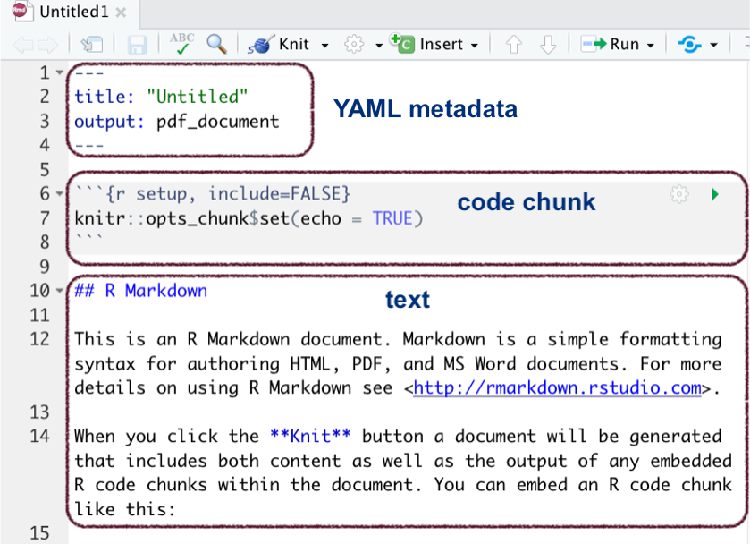
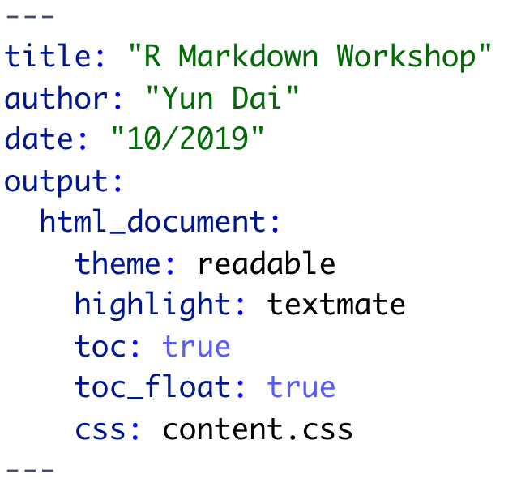
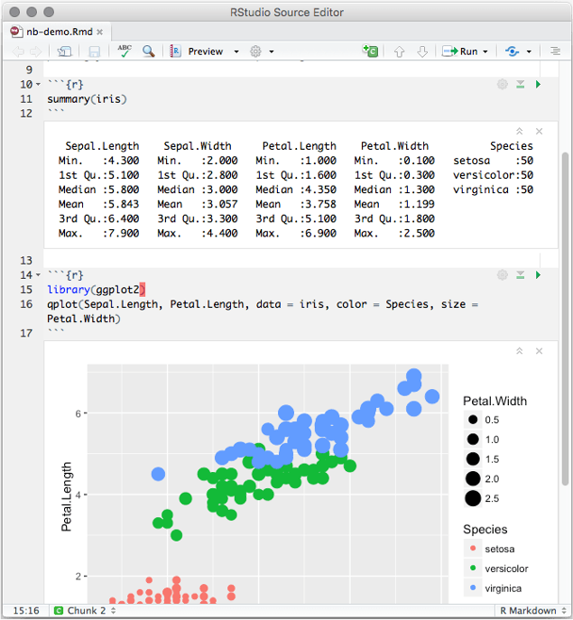
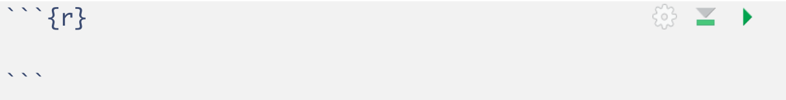
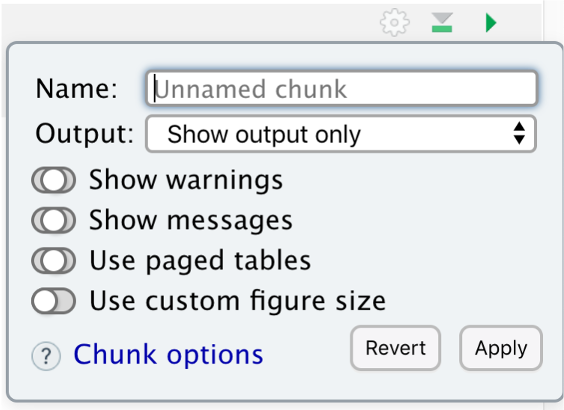
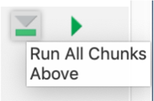
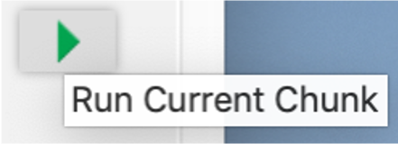
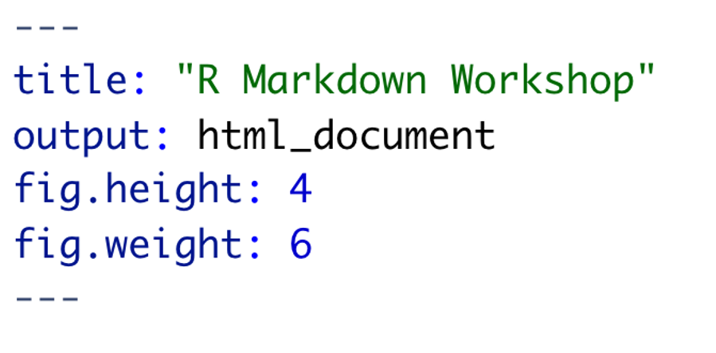
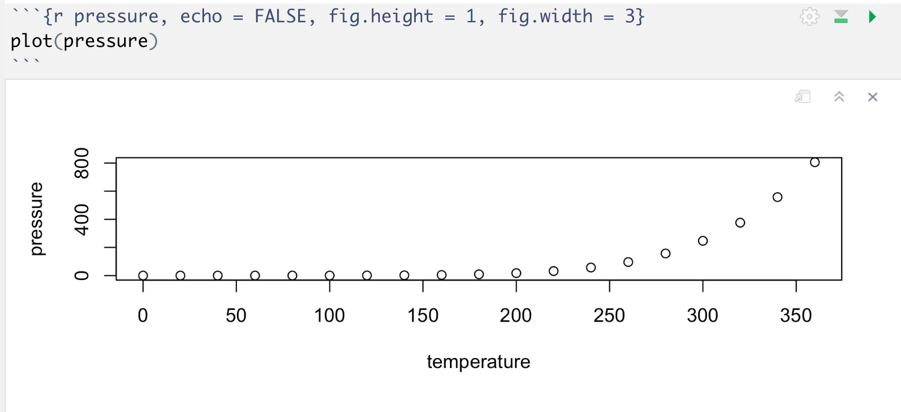
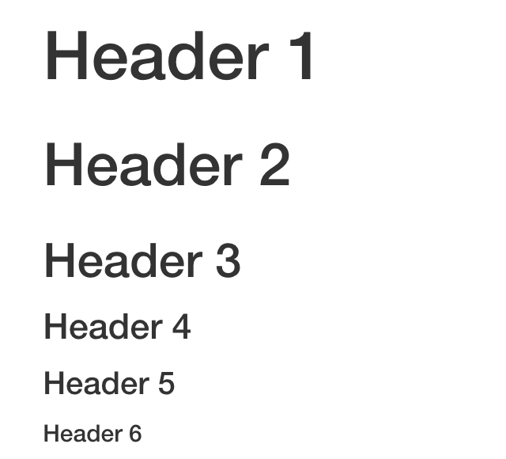

***
This is a summary of the workshop on the same topic.

***
## Why R Markdown
[R Markdown](https://rmarkdown.rstudio.com/) is an authoring framework for data science that enables easy creation of dynamic documents, presentations, and reports from R. It provides a notebook interface to connect data and run code as well as to generate reports that can be shared with an audience. R Markdown documents are fully reproducible.

As a language, R Markdown is an extension of the markdown syntax that has embedded R code chunks; as an R package, it is a library to process and convert .Rmd files into a number of formats (see [more discussions](https://stackoverflow.com/questions/40563479/relationship-between-r-markdown-knitr-pandoc-and-bookdown) here).

***
### Installing R Markdown
We can install the R Markdown package from CRAN. Make sure your copy of R is of the latest version.

```{r eval=FALSE}
install.packages("rmarkdown")
```

***
###  Output formats
R Markdown supports a variety of static and dynamic output formats. 

* Documents
  + HTML
  + PDF
  + Word
* Presentations
  + PowerPoint
  + reveal.js
* Dashboards
* Websites
* Journals
* Books
* Interactive documents
* ...

Check all the supported formats by R Markdown [here](https://rmarkdown.rstudio.com/formats.html).

<center>


*Figure 1. Output formats. Screenshot of [RStudio introduction video](https://rmarkdown.rstudio.com/lesson-1.html)(1:01)*

</center>


***
## .Rmd file
An R Markdown file is a simple plain text file that has the file extension .Rmd. It consists of three types of content: YAML metadata, text, and code chunks. 

<center>

{width=80%}

*Figure 2. An Rmd file.*

</center>

***
### Rendering .Rmd file 
A report can be generated from an .Rmd file by simply clicking the “Knit” button in RStudio. The default output format of a knitted file is HTML. 

To generate PDF output from R Markdown, [you need to have a LaTeX distribution installed](https://bookdown.org/yihui/rmarkdown-cookbook/install-latex.html).

***
### Header
R Markdown documents start with a metadata section, the YAML metadata header, which can include document metadata such as title, author, date and output format. We can also control the appearance and style of a document by including a custom CSS file, specifying a theme, and adjusting the organization of its sections, among other options.

In the example below, we have set the title, author, date and output of the document. Besides, we have included several options for customization:

* `theme: readable` sets the *readable* HTML theme (check the [theme gallery](https://www.datadreaming.org/post/r-markdown-theme-gallery/)) 
* `highlight: textmate` specifies the syntax highlighting style
* `toc: true` & `toc_float: true` adds a floating table of contents
* `css: contents.css` applies a pre-defined style sheet to the document

Read more about customizing output [here](https://bookdown.org/yihui/rmarkdown/html-document.html).

<center>

{width=50%}

*Figure 3. Metadata at the top of an .Rmd file.*

</center>

***
### Text
Texts can be formatted with Pandoc’s Markdown, which we discuss below.

***
### Code chunks
R [code chunks](https://rmarkdown.rstudio.com/lesson-3.html), embedded with the Markdown syntax, can be executed independently and interactively. Code outputs are rendered immediately beneath the inputs. A variety of objects such as text, tables, and graphics can be produced in a code chunk.  

<center>

{width=80%}

*Figure 4. Code chunks.*

</center>

***
To insert code chunk, we can:

1. use the Insert button on the RStudio toolbar, 
2. use the keyboard shortcut Ctrl + Alt + I (Windows), or Cmd + Option + I (macOS), or 
3. type the chunk delimiters `` ```{r}``` ``.

Below we discuss the code chunk in more detail.

***
## Including code
### Chunk options
On the upper right corner of a code chunk, we can see three little icons. 

<center>



*Figure 5. Chunk options.*

</center>


The first icon can help us modify chunk options without typing code. Users have fine control over the outputs with the chunk options.

<center>

{width=40%}

*Figure 6. Modify Chunk Options.*

</center>

There are a variety of [chunk options](https://yihui.org/knitr/options/) for customizing components of a code chunk. 

<center>

{width=40%}

*Figure 7. Chunk Options.*

</center>

These chunk options include: 

* show output only `echo=FALSE`
* show code and output `echo=TRUE`
* show nothing (run code) `include=FALSE`
* show nothing (don't run code) `eval=FALSE, include=FALSE`
* show warnings `warning=TRUE`
* show messages `message=TRUE`
* use custom figure size `fig.height=, fig.width=` 
* ...

***

The second icon calls R to run all chunks above the current one. 

<center>

{width=40%}

*Figure 8. Run All Chunks Above.*

</center>

***
The third icon tells R to run the current chunk.

<center>

{width=40%}

*Figure 9. Run Current Chunk.*

</center>

***
### Inline code
To mark text as inline code, use a pair of backticks.

<span style="color: #F39C12;">*Input:*</span>

```
`code`
```

<span style="color: #7D3C98;">*Output:*</span>

This is inline `code`.

***
### Code block
To create a code block, put code in a pair of triple backticks ```.

<span style="color: #F39C12;">*Input:*</span>

````
```
code
```
````

<span style="color: #7D3C98;">*Output:*</span>

```
This is a code block.
```

***
### Including other code languages
In addition to R, an .Rmd file can execute code in many other languages, including:

* Python 
* SQL
* Bash 
* Rcpp
* Stan
* JavaScript
* CSS

To process a code chunk in another language, we should replace the `r` at the start of the code chunk declaration with the name of that language. For instance,

```
`` `{python echo=FALSE,results=TRUE}
l = [1,2,45,'Hello World!']
for i in l:
  print(l)
`` `
```

```{python echo=TRUE,results=TRUE}
l = [1,2,45,'Hello World!']
for i in l:
  print(l)
```


***
## Figures and images
In an .Rmd file, we can create figures with code and insert images.

***
### Adjusting figure sizes
One thing we often do with figures is adjusting their sizes. For figures generated by code, there are several places to do that. We may include `fig.height` and `fig.weight` in the header, to start with.

<center>

{width=40%}

*Figure 10. Set figure size in header.*

</center>

***
We may also set the figure height and the figure width as global options that apply to every chunk in the file by calling `knitr::opts_chunk$set` in a code chunk, usually put at the beginning of our file. 

In the case below, every figure in the document will have a width of 6 and a height of 4.

```
knitr::opts_chunk$set(fig.width = 6, fig.height = 4)
```

Note that what we pass to `knitr::opts_chunk$set` can be overwritten in individual chunk headers.

***
Lastly, we can also set the figure height and width as chunk options:

<center>



*Figure 11. Set figure size as chunk options*

</center>

***
### Emedding images
We may insert an image in an R Markdown file in several ways.

***
We can use the Markdown syntax, as shown below, to include a path, the width (optional), and a caption (optional). The syntax starts with an exclamation mark. The path can be a local path or a web url. We can set the image size in curve brackets `{}` at the end.

```


{width=20px}
{width=20%}
{width=20%, height=40%}
```


<span style="color: #F39C12;">*Input:*</span>

```

```

<span style="color: #7D3C98;">*Output:*</span>


***
We may also center the image with `<center> </center>`.  
  
```
<center>


NYU Shanghai Library

</center>
```

***
The other way to include an image is to use the knitr function `knitr::include_graphics()` in a code chunk. The code chunk options include `out.width` and `out.height` to set the image width and height, `fig.align` to set the alignment (`center`, `left`, `right`, and `default`), and `fig.cap` to set the caption.

<center>


*Figure 12. Embed image in code chunk.*

</center>

***
## Tables
R Markdown displays data frames and matrices as what we would see in the R console. 

```{r}
data("iris")
iris[1:6,]
```

***
If we need additional table formatting, we may use `knitr::kable()`. 

```{r message=FALSE,warning=FALSE}
library(knitr)
kable(iris[1:6,], caption = 'This is a title')
```

To embellish tables with more advanced styling, we may use the package [kableExtra](https://cran.r-project.org/package=kableExtra), which provides a variety of functions to build LaTeX and HTML tables.

To create professional looking tables to summarize regression models, the package [stargazer](https://cran.r-project.org/web/packages/stargazer/vignettes/stargazer.pdf) is recommended.

***
Additionally, we can also create tables with markdown by manually typing horizontal and vertical dashed lines.

<span style="color: #F39C12;">*Input:*</span>
```
First Header | Second Header
-------------|--------------
Content Cell | Content Cell
Content Cell | Content Cell
```

<span style="color: #7D3C98;">*Output:*</span> 

First Header | Second Header
-------------|--------------
Content Cell | Content Cell
Content Cell | Content Cell

<span style="color: #F39C12;">*Input:*</span>
```
  Right  Left     Center     Default
-------  ------ ----------   -------
   Cell  Cell      cell       cell
   Cell  Cell      cell       cell
```

<span style="color: #7D3C98;">*Output:*</span>

  Right  Left     Center     Default
-------  ------ ----------   -------
   Cell  Cell      cell       cell
   Cell  Cell      cell       cell
   

Notes on column alignment:

  + If the dashed line is flush with the header text on the right side but extends beyond it on the left, the column is **right-aligned**.
  + If the dashed line is flush with the header text on the left side but extends beyond it on the right, the column is **left-aligned**.
  + If the dashed line extends beyond the header text on both sides, the column is **centered**.
  + If the dashed line is flush with the header text on both sides, the **default** alignment is used (in most cases, this will be left).

***
## Formatting text with Markdown
We can format the text in an R Markdown file with [Pandoc’s Markdown](https://pandoc.org/MANUAL.html#pandocs-markdown), a set of ways to mark text to enable formatting. When we render an R Markdown file, it is first compiled to Markdown through the package knitr, and then converted to an output document (e.g., PDF, HTML, or Word) by Pandoc.

Now let's take a look at how to mark up text into formatted text for some elements.

***
### Headers
Section headers can be created on six levels, indicated by one to six pound signs.

<span style="color: #F39C12;">*Input:*</span>

```
# Header 1

## Header 2

### Header 3

#### Header 4

##### Header 5

###### Header 6
```

<span style="color: #7D3C98;">*Output:*</span>

{width=40%}

***
### Lists: unordered
Unordered list items start with `*`, `-`, or `+`. We can nest one list within another by indenting the sub-list.

<span style="color: #F39C12;">*Input:*</span>
```
* Item 1
* Item 2
	+ Item 2.1
	+ Item 2.2
		- Item 2.21
		- Item 2.22
```

<span style="color: #7D3C98;">*Output:*</span>

* Item 1
* Item 2
	+ Item 2.1
	+ Item 2.2
		- Item 2.21
		- Item 2.22
	
	
***		
### Lists: ordered
Ordered list items start with numbers, which can also be nested.

<span style="color: #F39C12;">*Input:*</span>
```
1. Item 1
2. Item 2
3. Item 3
```

<span style="color: #7D3C98;">*Output:*</span>

1. Item 1
2. Item 2
3. Item 3

***
### Links
Hyperlinks are created using the syntax `[text](link)`.

<span style="color: #F39C12;">*Input:*</span>

```
[R Markdown cheat sheet](https://shiny.rstudio.com/articles/rm-cheatsheet.html)
```

```
<https://shiny.rstudio.com/articles/rm-cheatsheet.html>
```

<span style="color: #7D3C98;">*Output:*</span>

[R Markdown cheat sheet](https://shiny.rstudio.com/articles/rm-cheatsheet.html)

<https://shiny.rstudio.com/articles/rm-cheatsheet.html>


***
### Block quotes

Blockquotes start with `>`.

<span style="color: #F39C12;">*Input:*</span>

```
Einstein once said

> I never said that.
```
<span style="color: #7D3C98;">*Output:*</span>

Einstein once said

> I never said that.

***
### Horizontal rule
A horizontal line starts with three or more asterisks or dashes.

<span style="color: #F39C12;">*Input:*</span>
```
******
------
```

<span style="color: #7D3C98;">*Output:*</span>

***

***
### Footnotes
Footnotes are put inside the square brackets after a caret `^[]`.

<span style="color: #F39C12;">*Input:*</span>
```
two footnotes [^1][^2] 
Check the notes at the bottom of this page.


[^1]: This is the footnote.
[^2]: This is another footnote.
```

<span style="color: #7D3C98;">*Output:*</span>

Here is a footnote reference.[^1][^2]
Check the note at the bottom of the page.


[^1]: Here is the footnote.
[^2]: Here is another footnote.

***
### Italicized text
Italicized text can be created using a pair of asterisk or underscores.

<span style="color: #F39C12;">*Input:*</span>
```
*text*
_text_
```

<span style="color: #7D3C98;">*Output:*</span>

*text*

_text_


***
### Bold text
Bold text can be created using a pair of double asterisks or double underscores.

<span style="color: #F39C12;">*Input:*</span>
```
**text**
__text__
```

<span style="color: #7D3C98;">*Output:*</span>

**text**

__text__


***
### Superscripts

A pair of carets (^) produce a superscript.

<span style="color: #F39C12;">*Input:*</span>
```
2^10^
```

<span style="color: #7D3C98;">*Output:*</span>

2^10^

***
### Subscripts

A pair of tildes (~) turn text to a subscript. 

<span style="color: #F39C12;">*Input:*</span>
```
H~2~O
```

<span style="color: #7D3C98;">*Output:*</span>

H~2~O


***
## Math expressions
The mathematical typesetting in R Markdown is based on LaTeX, a powerful tool to write mathematical equations and display mathematical notations. Read more about Latex [here](https://www.latex-project.org/).

Note that in tables notations are compiled as inline code using a pair of `$` while others are in display mode surrounded by a pair of `$$`.

***
### Inline and display mode
Inline LaTeX equations can be written in a pair of `$`.

***

#### inline mode

  <span style="color: #F39C12;">*Input:*</span>
  
  ```
  This is a math $expression$ in inline mode.
  ```
  
  <span style="color: #7D3C98;">*Output:*</span>
  
  This is a math $expression$ in inline mode.


***  
#### display mode
Math expressions of the display mode can be written in a pair of `$$`.

  <span style="color: #F39C12;">*Input:*</span>
  
  ```
  This is a math $$expression$$ in display mode.
  ```
  
  <span style="color: #7D3C98;">*Output:*</span>


  This is a math $$expression$$ in display mode.
  
***  
Alternatively:    
  
  <span style="color: #F39C12;">*Input:*</span>
  
  ```
  This is a math \[expression\] in display mode.
  ```
  
  <span style="color: #7D3C98;">*Output:*</span>
  
  This is a math \[expression\] in display mode.


***
### Math mode accents

***
#### hat

<span style="color: #F39C12;">*Input:*</span>

```
$$\hat{a}$$
```

<span style="color: #7D3C98;">*Output:*</span>

$$\hat{a}$$

***
#### bar

<span style="color: #F39C12;">*Input:*</span>

```
$$\bar{a}$$
```

<span style="color: #7D3C98;">*Output:*</span>

$$\bar{a}$$

***
#### tilde

<span style="color: #F39C12;">*Input:*</span>

```
$$\tilde{a}$$
```

<span style="color: #7D3C98;">*Output:*</span>

$$\tilde{a}$$

***
### Greek letters

  Input         |  Output
----------------|-----------------
    `$\pi$`     |     $\pi$      
    `$\Pi$`     |     $\Pi$       
 `$h(\theta)$`  |   $h(\theta)$      
  `$\Delta$`    |    $\Delta$      
 `$\epsilon$`   |   $\epsilon$     
  `$\alpha$`    |    $\alpha$            


***
### Subscript and superscript


***
#### subscript

  Input           |  Output
------------------|-----------------
  `$\beta_0$`     |     $\beta_0$     
`$\theta_1x_1$`   |   $\theta_1x_1$   


***
#### superscript

  Input         |  Output
----------------|-----------------
  `$p^{k}$`     |     $p^{k}$     
  `$e^{-z}$`    |    $e^{-z}$   


***
Example:

<span style="color: #F39C12;">*Input:*</span>

```
$y = \beta_0 + \beta_1x_1 + \beta_2x_2 + \beta_3x_3 + \epsilon$
$h(\theta) = \theta_0 + \theta_1x_1 + \theta_2x_2 + \theta_3x_3$
```

<span style="color: #7D3C98;">*Output:*</span>

$y = \beta_0 + \beta_1x_1 + \beta_2x_2 + \beta_3x_3 + \epsilon$

$h(\theta) = \theta_0 + \theta_1x_1 + \theta_2x_2 + \theta_3x_3$

***
### Sum

<span style="color: #F39C12;">*Input:*</span>

```
$$\sum_{i=1}^{m}$$
```

<span style="color: #7D3C98;">*Output:*</span>

$$\sum_{i=1}^{m}$$

***
Example:

<span style="color: #F39C12;">*Input:*</span>

```
$\sum_{i=1}^{n}{(rating-\hat{rating})^2}$
$l(\theta)=\sum_{i=1}^{m}{[y^ilog(h_\theta(x^i)) + (1-y^i)log(1-h_\theta(x^i))]}$
```

<span style="color: #7D3C98;">*Output:*</span>

$\sum_{i=1}^{n}{(rating-\hat{rating})^2}$

$l(\theta)=\sum_{i=1}^{m}{[y^ilog(h_\theta(x^i)) + (1-y^i)log(1-h_\theta(x^i))]}$

***
### Fractions

*Format:*

```
$$\frac{numerator}{denominator}$$
```

<span style="color: #F39C12;">*Input:*</span>

```
$$\frac{a+b}{b}$$
```

<span style="color: #7D3C98;">*Output:*</span>

$$\frac{a+b}{b}$$

<span style="color: #F39C12;">*Input:*</span>

```
$$1 + \frac{a}{b}$$
```

<span style="color: #7D3C98;">*Output:*</span>

$$1 + \frac{a}{b}$$

<span style="color: #F39C12;">*Input:*</span>

```
$$g(z) = \frac{1}{1+e^{-z}}$$
```

<span style="color: #7D3C98;">*Output:*</span>

$$g(z) = \frac{1}{1+e^{-z}}$$

***
Example:

<span style="color: #F39C12;">*Input:*</span>

```
$J(\theta)=\frac{1}{2m}\sum_{i=1}^{m}{(h(x^i)-y^i)^2}$
```

<span style="color: #7D3C98;">*Output:*</span>

$J(\theta)=\frac{1}{2m}\sum_{i=1}^{m}{(h(x^i)-y^i)^2}$


***
### Roots

*Format:*

```
$$\sqrt[n]{expression}$$
```

<span style="color: #F39C12;">*Input:*</span>

```
$$\frac{-b + \sqrt{b^2 - 4ac}}{2a}$$
```

<span style="color: #7D3C98;">*Output:*</span>

$$\frac{-b + \sqrt{b^2 - 4ac}}{2a}$$

<span style="color: #F39C12;">*Input:*</span>

```
$$\sqrt[3]{q + \sqrt{ q^2 - p^3 }}$$
```

<span style="color: #7D3C98;">*Output:*</span>

$$\sqrt[3]{q + \sqrt{ q^2 - p^3 }}$$

***

### Integral

*Format:*

```
$$\int^a_b$$
```

<span style="color: #F39C12;">*Input:*</span>

```
$$\int^a_b \frac{1}{3}x^3$$
```

<span style="color: #7D3C98;">*Output:*</span>

$$\int^a_b \frac{1}{3}x^3$$

***
### Partial derivative

<span style="color: #F39C12;">*Input:*</span>

```
$$\frac{\partial u}{\partial t}$$
```

<span style="color: #7D3C98;">*Output:*</span>

$$\frac{\partial u}{\partial t}$$

***
Example:

<span style="color: #F39C12;">*Input:*</span>

```
$\frac{\partial}{\partial \theta_j}J(\theta)=\frac{1}{m}\sum_{i=1}^{m}{(h(x^i)-y^i)x^i_j}$
```

<span style="color: #7D3C98;">*Output:*</span>

$\frac{\partial}{\partial \theta_j}J(\theta)=\frac{1}{m}\sum_{i=1}^{m}{(h(x^i)-y^i)x^i_j}$


***
### Matrices

<span style="color: #F39C12;">*Input:*</span>

```
$$
\begin{matrix} 
a & b \\
c & d 
\end{matrix}
\quad
\begin{pmatrix} 
a & b \\
c & d 
\end{pmatrix}
\quad
\begin{bmatrix} 
a & b \\
c & d 
\end{bmatrix}
\quad
$$
```

<span style="color: #7D3C98;">*Output:*</span>

$$
\begin{matrix} 
a & b \\
c & d 
\end{matrix}
\quad
\begin{pmatrix} 
a & b \\
c & d 
\end{pmatrix}
\quad
\begin{bmatrix} 
a & b \\
c & d 
\end{bmatrix}
\quad
$$


***
## Read more
[Get Started, RStudio](https://rmarkdown.rstudio.com/)

[Markdown Basics](https://rmarkdown.rstudio.com/authoring_basics.html)

[R Markdown cheat sheet](https://shiny.rstudio.com/articles/rm-cheatsheet.html)

[R Markdown — Dynamic Documents for R](https://support.rstudio.com/hc/en-us/articles/205368677-R-Markdown-Dynamic-Documents-for-R)

[R Markdown: The Definitive Guide](https://bookdown.org/yihui/rmarkdown/)

[Pandoc's Markdown](https://pandoc.org/MANUAL.html#pandocs-markdown)

